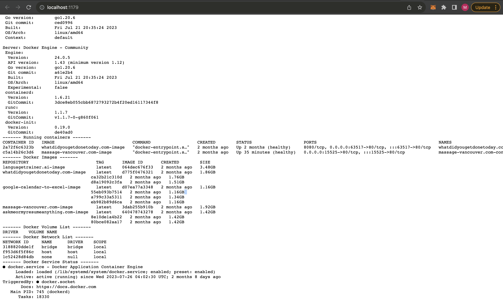

 # Instant Script Monitoring Dashboard

 Generate a comprehensive dashboard for any given script. Spin up a webserver which provides exhaustive debug information about any script 

 

 ## Prerequisites
 - `npm`
 - `nodejs`
 - `bash`
 - The `OPENAI_API_KEY` environment variable must be set.

 ## Quickstart

 `export OPENAI_API_KEY=asdf npx instant-dashboard@latest ./path-to-your-script.sh`

 ## Configuration
 To specify a custom port, use the `PORT` environment variable. If not set, the default port 1179 will be used.

